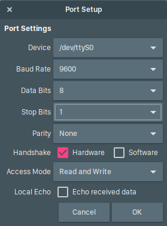

<!-- the consecutive `/` and `*` are used to separate slides horizontally and vertically -->
<!-- remove all of them if the final presentation is implemented on some other platform -->

<!-- .slide: data-background="#222423" id="the-beginning" -->
## Serial Communication & Programming <!-- .element: style="color:#eee; font-size: 1.5em" -->

### a brief introduction <!-- .element： style="font-size: 1.2em" -->

`Jack Q` <!-- .element: style="color:#68a;font-size: 0.4em" -->
<br/>`Oct. 2017` <!-- .element: style="color:#579;font-size: 0.4em" -->
****************************************

## Agenda
* [Introduction](#section-introduction) <!-- .element: class="fragment" data-fragment-index="1" -->
* [Serial Communication](#section-serial-communication) <!-- .element: class="fragment" data-fragment-index="2" -->
* [UART](#section-uart) <!-- .element: class="fragment" data-fragment-index="3" -->
* [Serial Port Programming](#section-serial-port-programming) <!-- .element: class="fragment" data-fragment-index="4" -->
* [Summary](#section-summary) <!-- .element: class="fragment" data-fragment-index="5" -->
****************************************

<!-- .slide: data-background="#09c" id="section-introduction" -->
## Introduction  <!-- .element: style="color:#eee" -->

****************************************

### Basic Model
* large monolith is a impractical means to implement large system
* system is generally divided into isolated and encapsulated units
* system is still a united body to be functional
* requires communication between two independent units

<pre style="text-align: center">
  +-----+                            +-----+
  |  A  |       <= Message =>        |  B  |
  +-----+  (Data, Control Signals)   +-----+
</pre>

>>>>>>>>>>>>>>>>>>>>>>>>>>>>>>>>>>>>>>>>

### Basic Model

Problems to consider for inter-unit communication

* Connection: lines, distance
* Direction: one-way, two-way
* Synchronization: sync (clock), async (agreement)
* Error detection/correction: parity bit, ECC
* Transmission protocol

****************************************
### Serial vs. Parallel
* Serial: sending data sequentially, one bit(symbol) at a time;
  ```txt
  +-----+    0,1,...    +-----+
  |  A  + --->>--->>--- +  B  |
  +-----+               +-----+
  ```
* Parallel: sending several bits as a whole;
  ```txt
  +-----+ --->>-0->>--- +-----+
  |  A  + --->>-1->>--- +  B  |
  +-----+      ...      +-----+
  ```

>>>>>>>>>>>>>>>>>>>>>>>>>>>>>>>>>>>>>>>>

### Serial vs. Parallel

|          |         Serial         |            Parallel         |
|---------:|:----------------------:|:----------------------------|
|*Cost*    |        Lower           |         Higher              |
|*Distance*|      Relative Longer   |         Shorter             |
|*Speed*   |      Slower            |         Faster              |

>>>>>>>>>>>>>>>>>>>>>>>>>>>>>>>>>>>>>>>>

### Serial vs. Parallel
* Serial connection reduces the cost
  - less lines & pins required (to reduce the cost)
  - simplified transmission (clock skew problem) (interference) (to transmit further and more reliable)

* Also introduces extra cost and complexities
  - compromise of speed: speed critical scenarios
  - extra complexity to process the message (bits reassemble, error check)

>>>>>>>>>>>>>>>>>>>>>>>>>>>>>>>>>>>>>>>>

### Serial vs. Parallel

Examples in our PC

* Parallel: 
  - PCI Express
  - SCSI (Small computer system interface)
  - IDE (Integrated Drive Electronics)
  - ...
* Serial:
  - USB (universal serial bus)
  - Ethernet
  - SATA (serial AT attachment)
  - RS232 (Serial Port)
  - PS/2 (Mouse, Keyboard)
  - ...

****************************************
<!-- .slide: data-background="#09c" id="section-serial-communication" -->
## Serial Communication  <!-- .element: style="color:#eee" -->

****************************************

## Serial Communication
Definition:

> In telecommunication and data transmission, serial communication is 
> the process of sending data one bit at a time, sequentially, over 
> a communication channel or computer bus. 
> <br /> (Wikipedia)

>>>>>>>>>>>>>>>>>>>>>>>>>>>>>>>>>>>>>>>>

## Serial Bus / Serial Cable
* Serial Cable: for data transmission on relative larger distance
  - improve reliability / transmission distance
  - USB, RS232 (Serial Port)
 
* Serial Buses: for data transmission between two integrated circuits
  - reduce connection pins
  - generally support multi-drops
  - Sample: I<sup>2</sup>C, 1-Wire

>>>>>>>>>>>>>>>>>>>>>>>>>>>>>>>>>>>>>>>>

## Data transmission direction:
* Uni-directional (one-way communication)
  - transmission only
  - receipt only
* Bi-directional
  - Semi-duplex: cannot transmit/receive simultaneously
  - Full-duplex: supports simultaneously transmission/reception


>>>>>>>>>>>>>>>>>>>>>>>>>>>>>>>>>>>>>>>>

## Transmit quality control
* no mechanism for error detection/correction 
  - assume the signal tunnel is reliable
  - prefer transmission rate to quality 
  - apply to scenario which tolerate occasionally errors
* build-in mechanism in hardware/low-level protocol
  - error detection: parity, CRC, etc (requires resend)
  - error correction: Hamming code, etc (recover from error)
* implement reliability control in application layer
  - various protocols in the Internet

>>>>>>>>>>>>>>>>>>>>>>>>>>>>>>>>>>>>>>>>

## Example: One-Wire
* 1-Wire: connect to multiple peripherals with a single data line
* Application scenario: large scale deployment of sensors
* Communication Procedure:
  [DS18B20 Thermometer Reference](./reference/DS18B20.pdf#page=13)
* Read/Write "0"/"1":
  [DS18B20 Thermometer Reference](./reference/DS18B20.pdf#page=16)

>>>>>>>>>>>>>>>>>>>>>>>>>>>>>>>>>>>>>>>>

## Example: One-Wire 

```c
#define Pin(OneWireStruct) \
  OneWireStruct->GPIOx, OneWireStruct->GPIO_Pin

/* Init OneWire Struct with GPIO information
* param:
*   OneWire: struct to be initialized
*   GPIOx: Base of the GPIO DQ used, e.g. GPIOA
*   GPIO_Pin: The pin GPIO DQ used, e.g. 5
*/
void OneWire_Init(
    OneWire_t* OneWireStruct, 
    GPIO_TypeDef* GPIOx, 
    uint32_t GPIO_Pin
  ) {
  OneWireStruct->GPIOx = GPIOx;
  OneWireStruct->GPIO_Pin = GPIO_Pin;
  GPIO_SetPinPull(Pin(OneWireStruct), GPIO_PUUP);
  GPIO_SetPinOutputType(Pin(OneWireStruct), 
    GPIO_OUTPUT_PUSHPULL);
  GPIO_SetPinSpeed(Pin(OneWireStruct), 
    GPIO_SPEED_FREQ_MEDIUM);
  GPIO_SetPinMode(Pin(OneWireStruct), GPIO_MODE_INPUT);
}

/* Send reset through OneWireStruct
* param:
*   OneWireStruct: wire to send
* retval:
*    0 -> Reset OK
*    1 -> Reset Failed
*/
uint8_t Reset(OneWire_t* OneWireStruct) {
  register int i;
  ResetPin(Pin(OneWireStruct));
  GPIO_SetPinMode(Pin(OneWireStruct), GPIO_MODE_OUTPUT);
  i = 5000; while(--i);
  GPIO_SetPinMode(Pin(OneWireStruct), GPIO_MODE_INPUT);
  i = 15; while(--i);
  i = 10000;
  while(IsSetPin(Pin(OneWireStruct)) && --i);
  i = 10000;
  while(!IsSetPin(Pin(OneWireStruct)) && --i);
  return !!i;
}

/* Write 1 bit through OneWireStruct
* param:
*   OneWireStruct: wire to send
*   bit: bit to send
*/
void WriteBit(OneWire_t* OneWireStruct, uint8_t bit) {
  register int i;
  ResetPin(Pin(OneWireStruct));
  i = IsSetPin(Pin(OneWireStruct));
  GPIO_SetPinMode(Pin(OneWireStruct), GPIO_MODE_OUTPUT);
  i = IsSetPin(Pin(OneWireStruct));
  i = 10; while(--i); // > 1 us
  if(bit){
    // Write 1 Slot
    GPIO_SetPinMode(Pin(OneWireStruct), GPIO_MODE_INPUT);
    i = 150; while(--i); // > 45us + (15us) duration
  }else{
    // Write 0 Slot
    i = 150; while(--i);// > 45us + (15us) duration
    GPIO_SetPinMode(Pin(OneWireStruct), GPIO_MODE_INPUT);
  }
}

/* Read 1 bit through OneWireStruct
* param:
*   OneWireStruct: wire to read from
*/
uint8_t OneWire_ReadBit(OneWire_t* OneWireStruct) {
  register int i; uint8_t bit;
  ResetPin(Pin(OneWireStruct));
  GPIO_SetPinMode(Pin(OneWireStruct), GPIO_MODE_OUTPUT);
  i = 3; while(--i); //  1 us
  GPIO_SetPinMode(Pin(OneWireStruct), GPIO_MODE_INPUT);
  i = 10; while(--i); // < 15 us
  bit = IsSetPin(Pin(OneWireStruct));
  i = 500; while(--i);// > 45 us + (~ us) duration

  return bit;
}

/* write 1 byte through OneWireStruct
* param:
*   OneWireStruct: wire to send
*   byte: byte to send
*/
void WriteByte(OneWire_t* OneWireStruct, uint8_t byte) {
  // in least significant bit first order
  for(int i = 0; i < 8; i++, byte >>= 1){
    WriteBit(OneWireStruct, byte & 1);
  }
}

/* read 1 byte through OneWireStruct
* Please use OneWire_ReadBit to implement
* param:
*   OneWireStruct: wire to read from
*/
uint8_t ReadByte(OneWire_t* OneWireStruct) {
  uint8_t byte = 0;
  for(int i = 0; i < 8; i++){
    byte = (byte >> 1) | (ReadBit(OneWireStruct) << 7);
  }
  return byte;
}
```
****************************************

## Serial Port (RS232)

* The most popular protocol: RS232
* RS232: Recommend Standard - 232
* Pin mode: DB9 (9 pins), DB25 ( 25 pins, similar to those parallel port)
* Support full-duplex transmission
* Configurable synchronization mechanism, error detection, sync/async mode, speed, etc 

>>>>>>>>>>>>>>>>>>>>>>>>>>>>>>>>>>>>>>>>

## Pin mode:
* DB9: 
<!-- TODO: image for DB9 -->
* DB25: 
<!-- TODO: image for DB25 -->

****************************************

## Serial Communication Parameters



Serial Port Setup (Screenshot of Moserial)

>>>>>>>>>>>>>>>>>>>>>>>>>>>>>>>>>>>>>>>>
* Device: Specifying device
  - Computer/MCU generally have multiple serial port
  - in Linux, specified by some special character devices/files
    (`/dev/ttyS0`, `/dev/ttyS1`, etc)
  - in Windows, specified by serial devices (`COM-0`， `COM-1`, etc)

>>>>>>>>>>>>>>>>>>>>>>>>>>>>>>>>>>>>>>>>

* Transmission Speed: Baud Rate / Symbol Rate
  - as linkage level connection, it transmit unit symbols
    (reflect the state change of connection line)
  - a bit in higher level application may requires multiple symbols
    (redundancy for error checking/correction)
  - named after Jean Maurice Emile Baudot
  - baud rate > bit rate (redundancy for reliability)

>>>>>>>>>>>>>>>>>>>>>>>>>>>>>>>>>>>>>>>>

* Data Bits:
  - actual carried message
  - transmit one byte each time
  - LSB first
  - a byte may contain 7, 8 or 9 bits
    (some device only support 7-bit ASCII)
* Stop Bits:
  - separator of byte (byte boundary)
  - synchronization (accumulated time skew)

>>>>>>>>>>>>>>>>>>>>>>>>>>>>>>>>>>>>>>>>

* Parity:
  - can be either odd/even
  - error detection 
  - no error recovery mechanism
* Handshake:
  - agreement to ensure matched stated or each end
  - flow control, equipment state report
  - reduce possible conflict (receive buffer rewrite)

>>>>>>>>>>>>>>>>>>>>>>>>>>>>>>>>>>>>>>>>

* Handshake via DB9


>>>>>>>>>>>>>>>>>>>>>>>>>>>>>>>>>>>>>>>>

* Self-loop
  - connect DR & DT to transmit message to itself
  - for testing purpose, like loopback address 127.0.0.1 in IPv4
* Self-handshake
  - sometimes, only one terminal supports RS232 handshake with fixed configuration
  - handshake with itself
  - connect RTS & CTS, DSR & DTR & DCD (illustrated at next page)

>>>>>>>>>>>>>>>>>>>>>>>>>>>>>>>>>>>>>>>>

* Self handshake via DB9
  

****************************************


<!-- .slide: data-background="#09c" id="section-uart" -->
## UART  <!-- .element: style="color:#eee" -->

universal asynchronous receiver & transmitter 
<!-- .element: style="color:#ccc" -->

****************************************

## UART/USART
* UART: universal asynchronous receiver & transmitter
* USART: universal synchronous/asynchronous receiver & transmitter 
* UART/USART provides flexible data exchange with external equipment
* RS232 is a lower level protocol (hardware) that a UART implementation may support (highly likely), 
  which specifying pin definition, voltage specification (+/- 5V-12V), handshake model, etc

****************************************

<!-- .slide: data-background="#09c" id="section-serial-port-programming" -->
## Serial Port Programming  <!-- .element: style="color:#eee" -->

****************************************

### Protocol Design
* communication protocol considerations
* 
* conventions
* sample

****************************************
### Programming model
* Loop
* Interrupt
* DMA
****************************************
### Operating system abstraction 
* file model
* device model
****************************************
### Blocking / Non-blocking
****************************************

<!-- .slide: data-background="#09c" id="section-summary" -->
## Summary  <!-- .element: style="color:#eee" -->
****************************************
### Inter-module Communication
* communication requirements
* serial / parallel communication
* comparison / applicable scenario
>>>>>>>>>>>>>>>>>>>>>>>>>>>>>>>>>>>>>>>>
### Serial Port (RS232)
* pin modes
* parameters: baud rate, transmitted bits, etc
* handshake
>>>>>>>>>>>>>>>>>>>>>>>>>>>>>>>>>>>>>>>>
### UART
* features
* timer and baud rate generator
* interrupt model
* DMA model
>>>>>>>>>>>>>>>>>>>>>>>>>>>>>>>>>>>>>>>>
### Serial Port Programming
* protocol design
* programming model: 
  - loop, interrupt, DMA
  - blocking/non-blocking
* implementation: 
  - Bare-board application
  - Linux file abstraction
****************************************

### References
* Exploratory Software Testing: Tips, tricks, tours and techniques to guide test design.
  [link](https://msdn.microsoft.com/en-us/library/jj620911.aspx)
* BBST17: Exploratory testing: [PDF](./reference/BBST17-Exploratory-testing.pdf)
* BBST18: Paired Exploratory testing: [PDF](./reference/BBST18-Paired-Exploratory-Testing.pdf)
* The Nature of Exploratory Testing: [PDF](./reference/The-Nature-of-Exploratory-Testing.pdf)
* A Tutorial in Exploratory Testing: [PDF](./reference/A-Tutorial-in-Exploratory-Testing.pdf)
* Exploratory Testing: An Overview [PDF](./reference/Exploratory-Testing-An-Overview.pdf)
****************************************

### Other material
(currently not used in pervious contents)
* Exploratory Testing: A Multiple Case Study [PDF](./reference/Exploratory-Testing-A-Multiple-Case-Study.pdf)
* How is Exploratory Testing Used:A State-of-the-Practice Survey [PDF](./reference/How-is-Exploratory-Testing-Used-A-State-of-the-Practice-Survey.pdf)
* 3 Simple Tricks to Make Exploratory Testing More Efficient [link](http://reqtest.com/testing-blog/3-simple-tricks-to-make-exploratory-testing-more-efficient/)
****************************************

<!-- .slide: data-background="#222423" id="the-end" -->
## Thanks <!-- .element: style="color:#eee" -->

the end <!-- .element: style="color:#aaa" -->

(By Jack Q, licensed under CC-BY-SA 4.0 Intl) <!-- .element: style="color:#444; font-size: 0.4em" -->